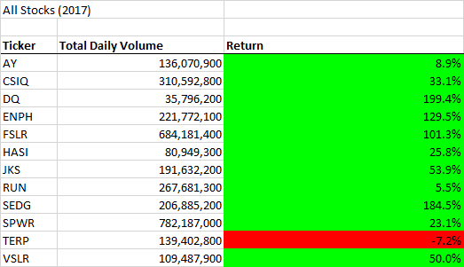

# Stock---Analysis
## OVERVIEW
### 1. Background: 
Steve's parents are interested in the analysis of few stocks, specifically DAQO's. They want to know how actively DQ was trading (comparing 2017 and 2018).    
  
### 2. Steve's Objectives:
- Keep track of total daily volume (total number of shares traded throughout a day)
- Obtain yearly return for each stock
 
### 3. Main Goals:
Steve wants to enable macros on his computer in order to run the analysis whenever he wants with the least amount of time.  To do that, an existing code will be refactored in order to make his daily tasks more efficient by shortening the time the analysis runs.

## RESULTS AND ANALYSIS of STOCKS
## Results
### 1. Year 2017:
2017 portfolio shows an overall positive return. Out of twelve tickers, only one reveals a negative return **(TERP = -7.2%)**.  **DQ** positively outperformed the rest by scoring **199.4%**.

### 2. Year 2018:
2018 shows a rough trend. Out of twelve tickers, only two show positive returns, **ENPH (81.9%) and RUN (84%)**.  **DQ**, on the other hand, scored the lowest at **-62.6%**.

## POST ANALYSIS SUGGESTIONS
- Steve should clearly communicate his findings about DQ to his parents.  Also, he should analyse 2018 market to better understand what caused the portfolio to perform so bad.

## SUMMARY OF MAIN GOALS
### Pros
Successfully refactored code reveals efficiency of the run times.  Refactored code looks cleaner and easier to update.  For Steve it means saved time and money in the future.  Both, 2017 and 2018 "run-time" reveal how fast the task was performed.

### Cons
Refactoring includes renaming variables and introducing/using different code for execution.  This can lead to new errors.

 
